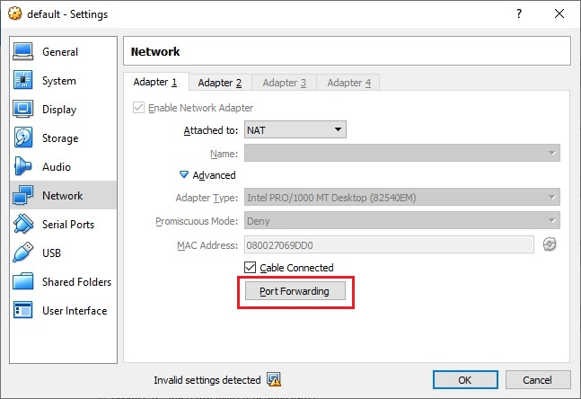
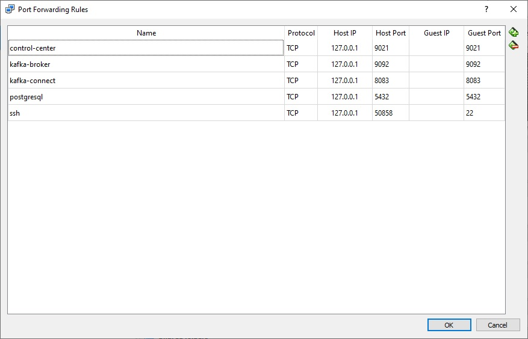

# Docker Toolbox configuration prerequisites

## Setting up enough RAM for the Docker VM

Open Virtual Box as an Administrator. Shutdown the `default` VM which represents the Docker virtual machine. Once turned off. Open the VM configuration and allocate at least 8GB (could work with less but has not been tested yet).

## Configure port redirection for localhost

Because this workshop expects the containers to be running on your host and not a Virtual Box VM, we will configure the network adapter of the Docker virtual machine to redirect all the ports we need.

Open the `default` virtual machine configuration window. Click on `Network` menu and click on the `Advanced` button of `Adapter 1`. You can now access the `Port Forwarding` configuration screen.

From this new screen. Configure the following new rules to allows localhost access to the services we will be deploying with Docker.

| Name | Host IP | Host Port | Guest Port |
|---|---|---|---|
| control-center | 127.0.0.1 | 9021 | 9021 |
| kafka-broker | 127.0.0.1 | 9092 | 9092 |
| kafka-connect | 127.0.0.1 | 9083 | 8083 |
| postgresql | 127.0.0.1 | 9092 | 9092 |

## Next step

With these configurations in please, you are now ready to resume the [regular track](../../README.md#workshop-instructions) of this workshop.