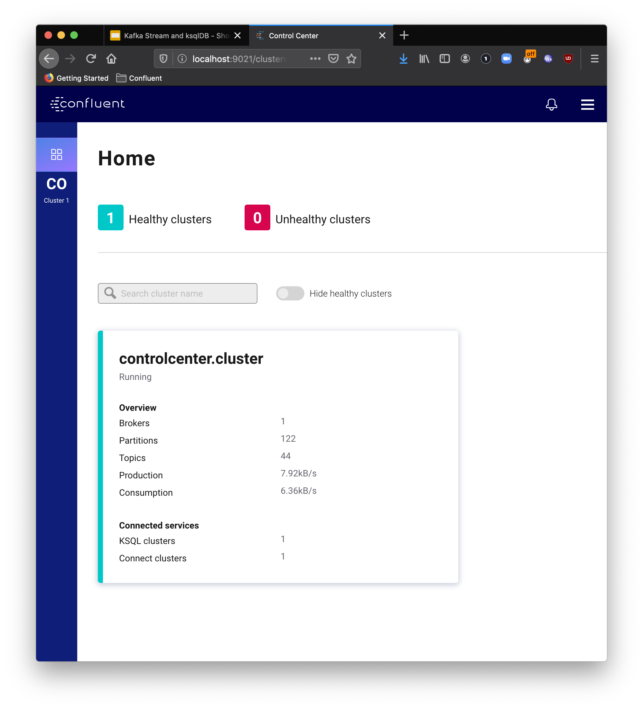

# [Main](../../README.md) / Workshop preperation

## Clone the repository

```
$ git clone https://github.com/daniellavoie/kafka-streaming-workshop
```

## Access the workshop folder

```
cd kafka-streaming-workshop
```

## Run the docker compose stack

All the infrastructure required for this demo runs as a Docker Compose Stack. A simple `docker-compose` command will setup the entire infrastructure required for our testing. Run the following command:

```
docker-compose -f docker-compose/local/docker-compose.yml up -d
```

## Wait for Confluent Control Center to be ready

Run the following command to access the logs from Control Center. It might take a couple of minutes for Control Center to bootstrap.

```
docker logs -f kstreams-demo-control-center
```

After running the `docker logs` command, stay alert for a mention that the Jetty is started. Logs can be very verbose, so it is easy to miss it. If you've been patient enough, you can just skip this part and access Conlfuent Control Center from http://localhost:9021.

```
[2020-02-08 14:44:15,059] INFO Started o.e.j.s.ServletContextHandler@7a93b263{/ws,null,AVAILABLE} (org.eclipse.jetty.server.handler.ContextHandler)
[2020-02-08 14:44:15,076] INFO Started NetworkTrafficServerConnector@8bffb8b{HTTP/1.1,[http/1.1]}{0.0.0.0:9021} (org.eclipse.jetty.server.AbstractConnector)
[2020-02-08 14:44:15,078] INFO Started @17727ms (org.eclipse.jetty.server.Server)
```

If the platform started properly, you will be able to explore the Confluent cluster details.



## Next step

When ready, move to the [next section](../connector/connector-linux.md) where you will generate some referential data. 